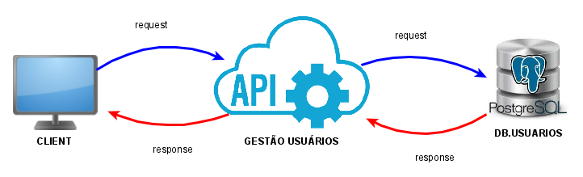

# Api Gestão Usuários



Steps to run this project:

1. You should create an virtual environment
```shell
    pip install virtualenv
    virtualenv venv
```
- to windows
```shell
    venv\Scripts\activate
```

- to linux
```shell
    venv\bin\activate
```

2. Then install [requirements.txt](requirements.txt)
```shell
    pip install -r requirements.txt
```

3. To run project you must run flask
```shell
    python server.py
```


## Endpoint: [Documentação](https://documenter.getpostman.com/view/6409788/T1LV8Nss?version=latest)


### Status da API
| Methods  | Actions                   | Url                                         |
|:--------:|:--------------------------|:--------------------------------------------|
| GET      | status da api             | {{url}/                                     |


### Usuários
| Methods  | Actions                                    | Url                            |
|:--------:|:-------------------------------------------|:-------------------------------|
| GET      | retorna todos os usuários cadastrados      | {{url}}/user                   |
| POST     | permite criar um novo usuário              | {{url}}/user/create            |
| GET      | retorna um usuário específico              | {{url}}/user/{{id:uuid}}       |
| PUT      | permite editar um usuário específico       | {{url}}/user/{{id:uuid}}       |
| DELETE   | permite remover um usuário específico      | {{url}}/user/{{id:uuid}}       |
